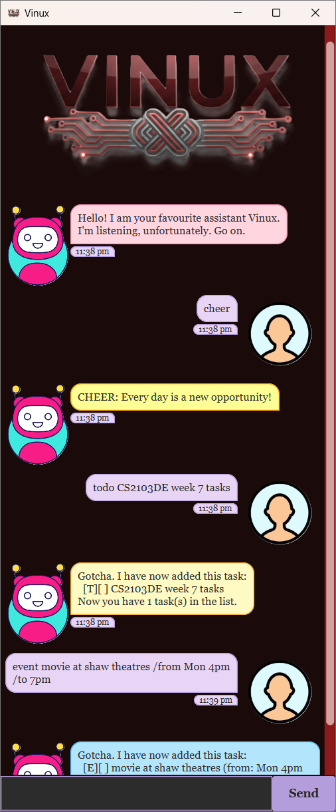

# Vinux User Guide

**Vinux** is a personal assistant chatbot that helps you manage tasks and track expenses. Vinux lets you organize your life efficiently through simple text commands.

---

## Table of Contents

- [Quick Start](#quick-start)
- [Features](#features)
    - [Managing Tasks](#managing-tasks)
        - [Adding a todo task: `todo`](#adding-a-todo-task-todo)
        - [Adding a deadline task: `deadline`](#adding-a-deadline-task-deadline)
        - [Adding an event task: `event`](#adding-an-event-task-event)
        - [Listing all tasks: `list`](#listing-all-tasks-list)
        - [Marking a task as done: `mark`](#marking-a-task-as-done-mark)
        - [Unmarking a task: `unmark`](#unmarking-a-task-unmark)
        - [Finding tasks: `find`](#finding-tasks-find)
        - [Deleting a task: `delete`](#deleting-a-task-delete)
        - [Clearing all tasks: `clear`](#clearing-all-tasks-clear)
    - [Managing Expenses](#managing-expenses)
        - [Adding an expense: `expense`](#adding-an-expense-expense)
        - [Listing all expenses: `expenses`](#listing-all-expenses-expenses)
        - [Deleting an expense: `deleteexpense`](#deleting-an-expense-deleteexpense)
        - [Viewing category total: `total`](#viewing-category-total-total)
        - [Viewing expense summary: `summary`](#viewing-expense-summary-summary)
    - [Other Commands](#other-commands)
        - [Getting motivation: `cheer`](#getting-motivation-cheer)
        - [Viewing help: `help`](#viewing-help-help)
        - [Exiting: `bye`](#exiting-the-program-bye)
- [Data Storage](#data-storage)
- [FAQ](#faq)
- [Known Issues](#known-issues)
- [Command Summary](#command-summary)

---

##Quick Start 

1. Ensure you have **Java 21** or above installed on your computer.

2. Download the latest `vinux.jar` file from [here](https://github.com/IV-pratibha-0912/ip/releases).

3. Copy the file to a folder you want to use as the home folder for Vinux.

4. Open a command terminal, navigate to that folder, and run:
```
   java -jar vinux.jar
```

5. A GUI similar to the below should appear:

   

6. Type commands in the input box and press **Send** (or press Enter) to execute them.

7. Try these example commands:
    - `help` : Shows all available commands
    - `todo Buy groceries` : Adds a todo task
    - `list` : Lists all your tasks
    - `expense food lunch /amount 12.50` : Tracks a lunch expense
    - `bye` : Exits the app

---

## Features

> **Notes about command format:**
> - Words in `UPPER_CASE` are parameters you supply.
> - Items in `[square brackets]` are optional.
> - Date format: `yyyy-MM-dd` (e.g., 2026-03-31)

---

### Managing Tasks

#### Adding a todo task: `todo`

Adds a todo task to your list.

**Format:** `todo <task description>`

**Examples:**
- `todo Buy groceries`
- `todo Finish CS2103DE assignment`

---

#### Adding a deadline task: `deadline`

Adds a task with a deadline.

**Format:** `deadline <task> /by <yyyy-MM-dd>`

**Examples:**
- `deadline Submit report /by 2026-03-31`
- `deadline Pay bills /by 2026-02-28`

---

#### Adding an event task: `event`

Adds an event with a start and end time.

**Format:** `event <task> /from <start> /to <end>`

**Examples:**
- `event Team meeting /from Mon 2pm /to 4pm`
- `event Conference /from 2026-03-15 /to 2026-03-17`

---

#### Listing all tasks: `list`

Shows all tasks in your list along with a summary.

**Format:** `list`

**Example output:**
```
Why do you have so many things to do?
These are your tasks:
1.[T][ ] Buy groceries
2.[D][ ] Submit report (by: Mar 31 2026)
3.[E][ ] Team meeting (from: Mon 2pm to: 4pm)

Task summary:
  Todos: 1
  Deadlines: 1
  Events: 1
  Completed: 0/3
```

---

#### Marking a task as done: `mark`

Marks a task as completed.

**Format:** `mark <index>`

**Example:**
- `mark 1` : Marks the 1st task as done

---

#### Unmarking a task: `unmark`

Marks a task as not done.

**Format:** `unmark <index>`

**Example:**
- `unmark 1` : Marks the 1st task as not done

---

#### Finding tasks: `find`

Finds tasks containing a keyword (case-insensitive).

**Format:** `find <keyword>`

**Examples:**
- `find meeting` : Shows all tasks containing "meeting"
- `find report` : Shows all tasks containing "report"

---

#### Deleting a task: `delete`

Removes a task from your list.

**Format:** `delete <index>`

**Example:**
- `delete 2` : Deletes the 2nd task

---

#### Clearing all tasks: `clear`

Removes all tasks from your list.

**Format:** `clear`

⚠️ **Warning:** This cannot be undone!

---

### Managing Expenses

#### Adding an expense: `expense`

Records an expense in a category.

**Format:** `expense <category> <description> /amount <amount>`

**Examples:**
- `expense food Lunch at cafe /amount 12.50`
- `expense transport Grab to office /amount 8.00`
- `expense books Python textbook /amount 45.00`

---

#### Listing all expenses: `expenses`

Shows all your expenses with a total.

**Format:** `expenses`

**Example output:**
```
Here are your expenses:
1. [FOOD] Lunch at cafe - $12.50
2. [TRANSPORT] Grab to office - $8.00
3. [BOOKS] Python textbook - $45.00

Total spent: $65.50
```

---

#### Deleting an expense: `deleteexpense`

Removes an expense from your records.

**Format:** `deleteexpense <index>`

**Example:**
- `deleteexpense 1` : Deletes the 1st expense

---

#### Viewing category total: `total`

Shows total spending for a specific category.

**Format:** `total <category>`

**Example:**
- `total food` : Shows total spent on food

---

#### Viewing expense summary: `summary`

Shows spending breakdown by category.

**Format:** `summary`

**Example output:**
```
Expense summary by category:
  BOOKS: $45.00
  FOOD: $12.50
  TRANSPORT: $8.00

Total: $65.50
```

---

### Other Commands

#### Getting motivation: `cheer`

Displays a random motivational quote.

**Format:** `cheer`

---

#### Viewing help: `help`

Shows a guide of all available commands.

**Format:** `help`

---

#### Exiting the program: `bye`

Closes Vinux.

**Format:** `bye`

---

## Data Storage

### Automatic Saving

- Task data is saved automatically to `data/vinux.txt`
- Expense data is saved automatically to `data/expenses.txt`
- No manual saving required!

### Editing Data Files

⚠️ **Not recommended for most users!**

Data is stored as text files in the `data` folder:
- `vinux.txt` - your tasks
- `expenses.txt` - your expenses

While you can edit these files directly, incorrect formatting will cause data loss. Only edit if you know what you're doing!

---

## FAQ

**Q: How do I transfer my data to another computer?**

A: Copy the entire `data` folder from your Vinux home folder to the same location on the new computer.

**Q: Can I use Vinux without the GUI?**

A: Yes! Run `java -jar vinux.jar` in a terminal and use the command-line interface.

**Q: What happens if I add a duplicate task?**

A: Vinux will warn you but still add it. You can delete duplicates manually.

**Q: The window is too small, can I resize it?**

A: Yes! Drag the window edges to resize. The content will adjust automatically.

---

## Known Issues

- Very long task descriptions may wrap awkwardly
- The timestamp uses 12-hour format and cannot be changed
- Cannot undo deleted tasks or expenses

---

## Command Summary

| Action | Format | Example |
|--------|--------|---------|
| **Tasks** |
| Add todo | `todo <task>` | `todo Buy milk` |
| Add deadline | `deadline <task> /by <date>` | `deadline Submit /by 2026-03-31` |
| Add event | `event <task> /from <start> /to <end>` | `event Meeting /from Mon 2pm /to 4pm` |
| List tasks | `list` | `list` |
| Mark done | `mark <index>` | `mark 1` |
| Unmark | `unmark <index>` | `unmark 1` |
| Find | `find <keyword>` | `find book` |
| Delete task | `delete <index>` | `delete 2` |
| Clear all | `clear` | `clear` |
| **Expenses** |
| Add expense | `expense <cat> <desc> /amount <amt>` | `expense food lunch /amount 12.50` |
| List expenses | `expenses` | `expenses` |
| Delete expense | `deleteexpense <index>` | `deleteexpense 1` |
| Category total | `total <category>` | `total food` |
| Summary | `summary` | `summary` |
| **Other** |
| Help | `help` | `help` |
| Motivation | `cheer` | `cheer` |
| Exit | `bye` | `bye` |

---

**Vinux** - Your sassy personal assistant. I'm listening, unfortunately. 😏
